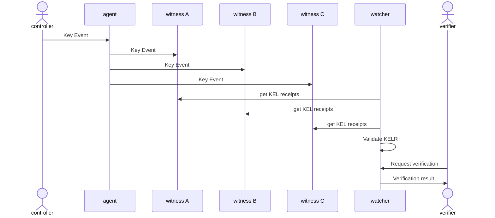
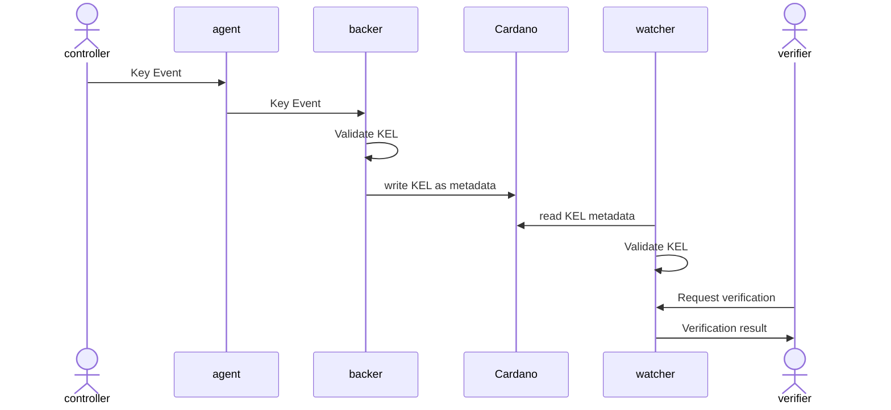
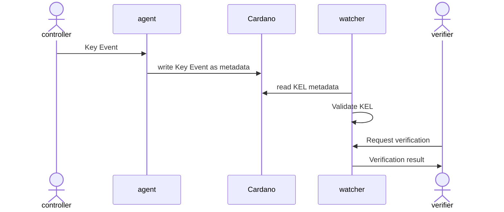

# Cardano Watcher Design

## Ecosystem
The folloging diagram of a generic KERI/ACDC ecosystem shows the **Cardano Watcher** positioned between the secondary root of trust provided by witnesses and the Cardano blockchain, and the verifiers:

## Flow of events
The following sequence diagrams show a simplified flow of events for three different cases:
1. an AID witnessed by a set of witnesses
2. an AID witnessed by a Cardano Backer
3. an AID witnessed by the Cardano Blockchain

### AID witnessed by a set of witnesses

### AID witnessed by Cardano Backer

### AID witnessed by Cardano Blockchain

## Architecture
System requirements:
* Run as a persistent process in a backend server
* Developed in Python since it depends on main KERI/ACDC library [keripy](https://github.com/WebOfTrust/keripy)
* Perfom periodic and on demand queries to witnesses
* Permanent crawl of Cardano transaction metadata and maintain sync
* Provide API for verifiers
* Provide web portal for verifiers
* Persistent database of AIDs and witnesses
* Persistent log of transactions

The following diagram shows the basic components of the system:

1. **Blockchain crawler**: this component is in charge of retrieving blocks from the blockchain, detecting if a transaction with metadata correspond to a key event and submiting the event to the verification engine. It must ensure to be fully in sync with the blockchain past and current state. If needed, the service must replay the full blockchain and ensure its validity. 
2. **Witness polling**: this service must poll through the set of known witnesses and request latest Key Events from known AIDs. New events must be submitted to the verification engine to be validated. Additionally, the polling mechanism should be use to generate availability statistics for the known witnesses.
3. **Verifiers API**: this API must expose an endpoint to verifiers to submit verificarion request of a certain AID. The API should also provide methods to request additions of AIDs and Witnesses to the monitoring poll. 
4. **Verifiers Web Portal**: this component is a web app designed to be public and available for verifiers to request verification from a GUI. It should also provide statistics of the service and known entities.
5. **Verificarion engine and processing**: this is teh service that actual perfome the KEL verification to detect duplicity and inconsistems events produces by dishonest identity controllers or malicious third party that may have exploited vulnerabilities on the controller of the identifier. In the future this engine will be use to validate ACDC credentials. 
6. **Database**: persitent storage of KELs, events and transactions

## Feature set
### Required features
* detect and register AIDs to watch: provide a way to add new identifiers by an API and a web portal. Additionally, any Key Event of a new identifier detected in the blockchain should register the new identifier
* register witnesses to watch: provide a way to add new witnesses by an API and a web portal.
* crawl Cardano tx metadata, detect and validate Key Events: the system should crawl the block chain to detect Key Events and validate its integrity. Results of the verification should be stored and made public to verifiers.
* crawl witnesses to detect new key events and validate: for AIDs that use witnesses instead of the blockchain, its witnesses must be queried to get the KELs and perform validation. Results of the verification should be stored and made public to verifiers.
* monitor witnesses: know witnesses should be monitored for statistical purposes of availability.
* API to verify AID: the verification process should be exposed in a public API
* Web portal to verify AID: the verificarion process should be available in a public web portal
* Web portal with metrics and statistics: the web portal should show metrics and statistics of it elements and known witnesses.

### Features requested(future)
* signature verification
* ACDC verification
