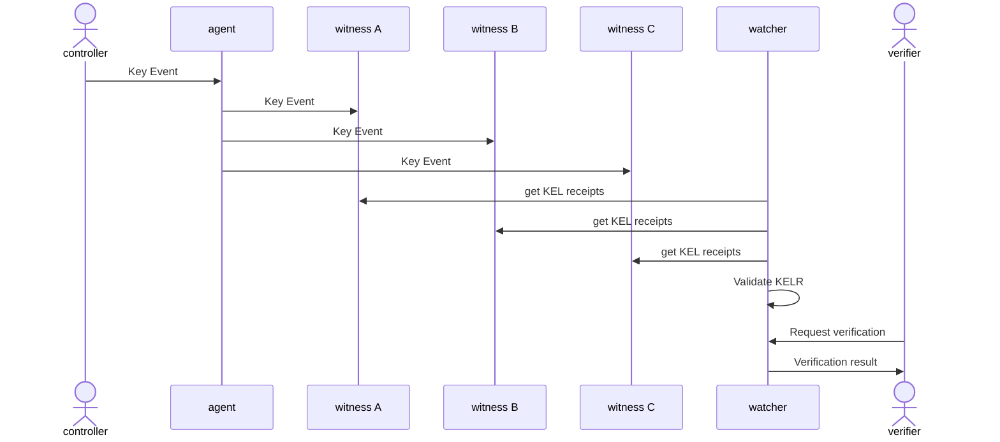
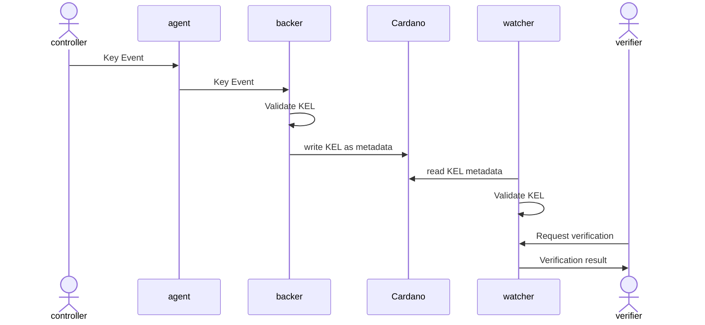
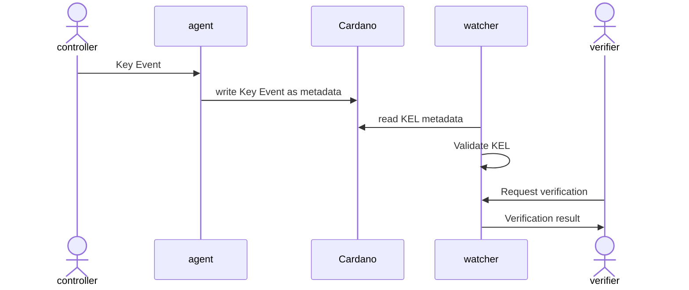

# Cardano Watcher Design

## Ecosystem
The folloging diagram of a generic KERI/ACDC ecosystem shows the **Cardano Watcher** positioned between the secondary root of trust provided by witnesses and the Cardano blockchain and the verifiers:

# Flow of events
The following sequence diagrams show a simplified flow of events for three different cases:
1. an AID witnessed by a set of witnesses
2. an AID witnessed by a Cardano Backer
3. an AID witnessed by the Cardano Blockchain

### AID witnessed by a set of witnesses

### AID witnessed by Cardano Backer

### AID witnessed by Cardano Blockchain

## Feature set
