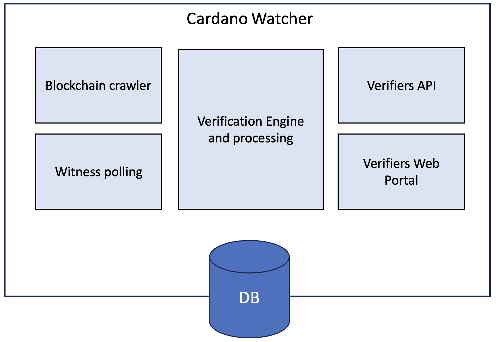

# Cardano Watcher Design

## Ecosystem
The folloging diagram of a generic KERI/ACDC ecosystem shows the **Cardano Watcher** positioned between the secondary root of trust provided by witnesses and the Cardano blockchain and the verifiers:

# Flow of events
The following sequence diagrams show a simplified flow of events for three different cases:
1. an AID witnessed by a set of witnesses
2. an AID witnessed by a Cardano Backer
3. an AID witnessed by the Cardano Blockchain

### AID witnessed by a set of witnesses

### AID witnessed by Cardano Backer

### AID witnessed by Cardano Blockchain

## Architecture
System requirements:
* Run as a persistent process in a backend server
* Developed in Python since it depends on main KERI/ACDC library [keripy](https://github.com/WebOfTrust/keripy)
* Perfom periodic and on demand queries to witnesses
* Permanent crawl of Cardano transaction metadata and maintain sync
* Provide API for verifiers
* Provide web portal for verifiers
* Persistent database of AIDs and witnesses
* Persistent log of transactions

The following diagram shows the basic components of the system:

1. Blockchain crawler
2. Witness polling
3. Verifiers API
4. Verifiers Web Portal
5. Verificarion engine and processing

## Feature set
### Required features
* detect and register AIDs to watch
* register witnesses to watch
* crawl Cardano tx metadata, detect and validate Key Events
* crawl witnesses to detect new key events and validate
* monitor witnesses
* API to verify AID
* Web portal to verify AID
* Web portal with metrics and statistics

### Features request(future)
* signature verification
* ACDC verification
